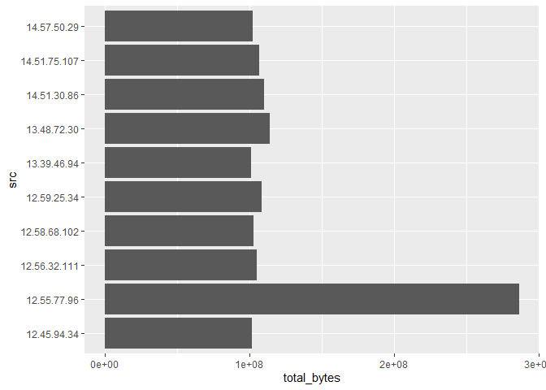
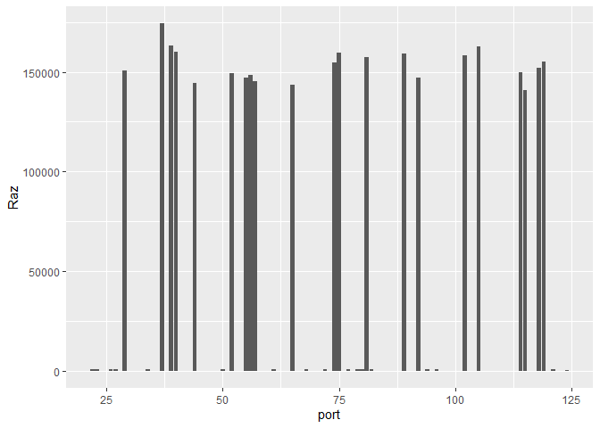
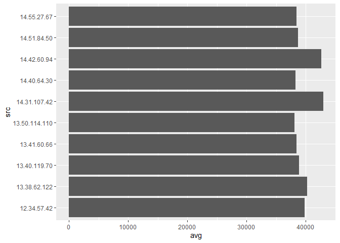

# Анализ данных сетевого трафика при помощи библиотеки Arrow Бондаренко
С.А.


## Цель работы:

1.  Изучить возможности технологии Apache Arrow для обработки и анализа
    больших данных

2.  Получить навыки применения Arrow совместно с языком программирования
    R

3.  Получить навыки анализа метаинформации о сетевом трафике

4.  Получить навыки применения облачных технологий хранения, подготовки
    и анализа данных: Yandex Object Storage, Rstudio Server

## Исходные данные

1.  Персональный компьютер

2.  Браузер

3.  R studio

4.  Библиотека Arrow

## Общий план выполнения работы

1.  Импорт данных

2.  Выполнение заданий

3.  Подготовить отчёт

## Содержание ЛР

### Шаг 1

**На данном шаге производится импорт данных.**

Скачивание файла с данными:

``` r
#download.file('https://storage.yandexcloud.net/arrow-datasets/tm_data.pqt', destfile = "tm_data.pqt")
```

Применение функции read_parquet пакета arrow:

``` r
library(arrow)
```

    Warning: пакет 'arrow' был собран под R версии 4.4.2


    Присоединяю пакет: 'arrow'

    Следующий объект скрыт от 'package:utils':

        timestamp

``` r
df <- read_parquet("tm_data.pqt", use_threads=False)
```

### Шаг 2

**На данном шаге производится выполнение заданий:**

#### Задание 1. Найдите утечку данных из Вашей сети

Важнейшие документы с результатами нашей исследовательской деятельности
в области создания вакцин скачиваются в виде больших заархивированных
дампов. Один из хостов в нашей сети используется для пересылки этой
информации – он пересылает гораздо больше информации на внешние ресурсы
в Интернете, чем остальные компьютеры нашей сети. Определите его
IP-адрес.

Из условия:

-   12-14 - ip-адреса внутренней сети

-   Все остальные - ip-адреса внешней сети

``` r
library(dplyr)
```

    Warning: пакет 'dplyr' был собран под R версии 4.4.2


    Присоединяю пакет: 'dplyr'

    Следующие объекты скрыты от 'package:stats':

        filter, lag

    Следующие объекты скрыты от 'package:base':

        intersect, setdiff, setequal, union

``` r
library(tidyverse)
```

    Warning: пакет 'tidyverse' был собран под R версии 4.4.2

    Warning: пакет 'ggplot2' был собран под R версии 4.4.2

    Warning: пакет 'tibble' был собран под R версии 4.4.2

    Warning: пакет 'tidyr' был собран под R версии 4.4.2

    Warning: пакет 'readr' был собран под R версии 4.4.2

    Warning: пакет 'purrr' был собран под R версии 4.4.2

    Warning: пакет 'stringr' был собран под R версии 4.4.2

    Warning: пакет 'forcats' был собран под R версии 4.4.2

    Warning: пакет 'lubridate' был собран под R версии 4.4.2

    ── Attaching core tidyverse packages ──────────────────────── tidyverse 2.0.0 ──
    ✔ forcats   1.0.0     ✔ readr     2.1.5
    ✔ ggplot2   3.5.1     ✔ stringr   1.5.1
    ✔ lubridate 1.9.4     ✔ tibble    3.2.1
    ✔ purrr     1.0.2     ✔ tidyr     1.3.1
    ── Conflicts ────────────────────────────────────────── tidyverse_conflicts() ──
    ✖ lubridate::duration() masks arrow::duration()
    ✖ dplyr::filter()       masks stats::filter()
    ✖ dplyr::lag()          masks stats::lag()
    ℹ Use the conflicted package (<http://conflicted.r-lib.org/>) to force all conflicts to become errors

Фильтрация по внутренней сети (ip-адреса начинаются с 12, 13 или 14):

``` r
internal_traffic <- df %>%
  filter(grepl("^12\\.|^13\\.|^14\\.", src)) %>% filter(!grepl("^12\\.|^13\\.|^14\\.", dst))
```

Группировка данных, суммирование объема переданных данных, сортировка по
убыванию:

``` r
summary_traffic <- internal_traffic %>%
  group_by(src) %>%
  summarise(total_bytes_sent = sum(bytes, na.rm = TRUE)) %>%
  arrange(desc(total_bytes_sent))
```

Выбор самого первого ip-адреса (по трафику наибольший):

``` r
top_ip <- head(summary_traffic, 1)
```

Вывод:

``` r
top_ip
```

    # A tibble: 1 × 2
      src          total_bytes_sent
      <chr>                   <dbl>
    1 13.37.84.125      10625497574

#### Задание 2. Найдите утечку данных 2

Другой атакующий установил автоматическую задачу в системном
планировщике сron для экспорта содержимого внутренней wiki системы. Эта
система генерирует большое количество трафика в нерабочие часы, больше
чем остальные хосты. Определите IP этой системы. Известно, что ее IP
адрес отличается от нарушителя из предыдущей задачи.

``` r
hourly_traffic <- internal_traffic%>%select(timestamp, src, dst, bytes)%>%mutate(time=hour(as_datetime(timestamp/1000))) %>%filter(time>=0&time<=24)%>% group_by(time)%>%summarise(trafictime=n())%>%arrange(desc(time))
```

``` r
print(hourly_traffic)
```

    # A tibble: 24 × 2
        time trafictime
       <int>      <int>
     1    23    4488093
     2    22    4489703
     3    21    4487109
     4    20    4482712
     5    19    4487345
     6    18    4489386
     7    17    4483578
     8    16    4490576
     9    15     168355
    10    14     169028
    # ℹ 14 more rows

``` r
#install.packages("ggplot2")
```

``` r
library(ggplot2)
```

``` r
ggplot(data = hourly_traffic, aes(x = time, y = trafictime)) + 
  geom_line() +
  geom_point()
```


Из таблицы и графика выше - предполагаемые рабочие часы: 16 - 23,
нерабочие: 1-15.

``` r
traffic_noWork <- internal_traffic %>% mutate(
   time=hour(as_datetime(timestamp/1000))
  ) %>%
  filter(
    time >= 1 & time <= 15,
    src != '13.37.84.125'
  ) %>%
  group_by(src) %>%
  summarise(
    total_bytes = sum(bytes)
  ) %>%
  arrange(desc(total_bytes))
```

``` r
ggplot(head(traffic_noWork, 10), aes(total_bytes, src)) + geom_col()
```



Вывод ip-адреса системы:

``` r
print(head(traffic_noWork, 1))
```

    # A tibble: 1 × 2
      src         total_bytes
      <chr>             <int>
    1 12.55.77.96   286315073

#### Задание 3. Найдите утечку данных из Вашей сети 3

Еще один нарушитель собирает содержимое электронной почты и отправляет в
Интернет используя порт, который обычно используется для другого типа
трафика. Атакующий пересылает большое количество информации используя
этот порт, которое нехарактерно для других хостов, использующих этот
номер порта. Определите IP этой системы. Известно, что ее IP адрес
отличается от нарушителей из предыдущих задач.

Необходимо найти порт, у которого разница между максимальным потоком и
средним по порту - наибольшая:

``` r
ports <- internal_traffic %>%
 filter(src != '13.37.84.125' & src != '12.55.77.96') %>%
  group_by(port) %>%
  summarise(
    mean_bytes = mean(bytes),
    max_bytes = max(bytes),
    sum_bytes = sum(bytes),
    Raz = max_bytes - mean_bytes
  ) %>%
  filter(Raz != 0) %>%
  arrange(desc(Raz))
```

``` r
ggplot(data = ports, aes(x = port, y = Raz)) + geom_col()
```



``` r
print(head(ports, 1))
```

    # A tibble: 1 × 5
       port mean_bytes max_bytes   sum_bytes     Raz
      <int>      <dbl>     <int>       <dbl>   <dbl>
    1    37     35090.    209402 32136394510 174312.

37 порт - подозрительный, поэтому выборка будет прозводится по 37 порту:

``` r
result <- internal_traffic %>%
  filter(port == 37) %>%
  group_by(src) %>% summarise(traffic = sum(bytes), count = n(), avg = traffic/count, med = median(bytes)) %>% arrange(desc(avg))
```

``` r
ggplot(head(result, 10), aes(avg, src)) + geom_col()
```



``` r
print(head(result, 1))
```

    # A tibble: 1 × 5
      src          traffic count    avg   med
      <chr>          <int> <int>  <dbl> <dbl>
    1 14.31.107.42 1288614    30 42954. 43732

## Оценка результата

Был произведен анализ данных сетевого трафика при помощи библиотеки
Arrow.

## Вывод

1.  Были изучены возможности технологии Apache Arrow для обработки и
    анализа больших данных

2.  Получены навыки применения Arrow совместно с языком программирования
    R

3.  Получены навыки анализа метаинформации о сетевом трафике

4.  Получены навыки применения облачных технологий хранения, подготовки
    и анализа данных: Yandex Object Storage, Rstudio Server
